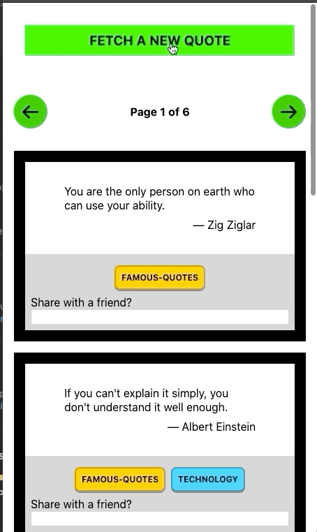

Objectives:
- Use Vue.js
  - I know this task was to produce a solution using Vue.js
  - However, I think that Vue is a terrible choice, especially for a generally green-field problem / company.
  - So in the interest of time I elected to use React. If that's not of interest, that's okay with me, and thank you for your time.
- Make requests to the chuck norris joke database
  - This database is full of offensive content with generally no filter.
  - *Trigger warning* - https://api.chucknorris.io/jokes/FnWEVtdzTm2XDCQV9ibjgA doesn't seem like it should be used in a test
  - Because of this, I'm gonna stop using that API (but feel free to checkout the previous commits, I had a partially working version using that offensive API).
    - Instead, I will be using this API: https://github.com/lukePeavey/quotable
    - It has similar content and interfaces (though it does not have a free text search)
- Incomplete User Stories
  + random joke every 30 seconds - ran into issues and ran out of time, elected to have a fetch button
  + page-able list, with navigation - pageable results
  + styled - using `@emotion`, would have moved to material but ran out of time
  + UI on fetch / request - exists
  + error messages on errors - not currently
  + filter jokes by category - not currently
  + filter jokes by search - not currently
  + email a joke - yes
  + about page - not currently
